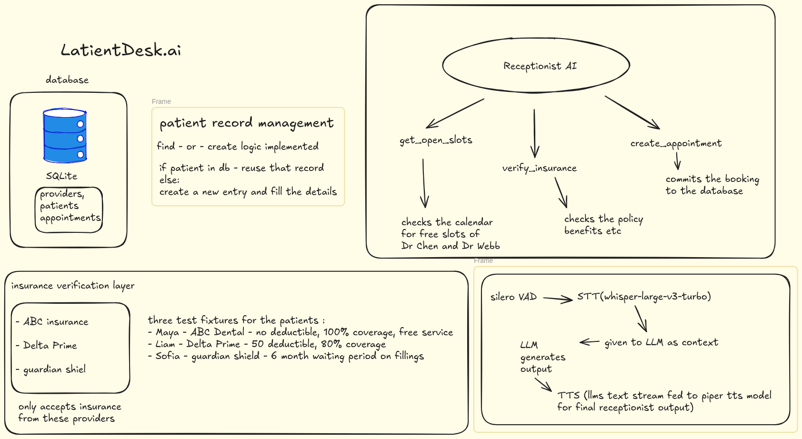

# LatientDesk.ai 🦷🎙️ — Autonomous AI Dental Receptionist

[](https://www.python.org/downloads/)
[](https://groq.com/)
[](https://github.com/pipecat-ai/pipecat)
[](https://streamlit.io/)
[](https://www.sqlite.org/)
[](https://www.cms.gov/)

**LatientDesk.ai** is an enterprise-grade autonomous AI receptionist tailored specifically for dental practices. It handles inbound patient interactions end-to-end over streaming voice and web chat: authenticating patients, checking live dentist schedules, calculating out-of-pocket costs with real-time insurance eligibility (HIPAA X12 270/271 emulation), resolving complex multi-slot scheduling constraints, and booking appointments directly into an ACID-compliant Practice Management System (PMS).

---

## 🏛️ System Architecture

LatientDesk.ai connects voice input, high-throughput LLM reasoning, practice management schedules, and payer insurance engines into an ultra-low-latency real-time pipeline.



### End-to-End Operational Pipeline
1. **Audio Ingestion & Activity Detection**:
   - Audio from the caller or browser microphone is streamed at 16 kHz.
   - **Silero VAD** detects human speech boundaries and handles turn interruptions gracefully.
2. **Speech-to-Text (STT)**:
   - Voice utterances are transcribed in real-time using **Groq Whisper Large v3**, achieving near-instantaneous transcription with high accuracy for medical terminology and patient names.
3. **Conversational Intelligence & Tool Calling**:
   - Powered by **Groq LPU-accelerated LLMs** (`openai/gpt-oss-20b`, `qwen/qwen3.8-27b`, or `llama-3.3-70b-versatile`).
   - The receptionist follows a strict conversational protocol: gathering patient demographics, verifying insurance *prior* to quoting costs, checking contiguous calendar slots, and confirming booking details.
4. **Practice Management System (PMS)**:
   - An ACID-compliant **SQLite** database (`demo.db`) manages doctors, operative chairs, patient profiles, and 30-minute calendar grid blocks.
   - Multi-slot procedure resolution ensures appointments spanning multiple consecutive blocks (e.g., 90-minute root canals taking 3 slots) are allocated contiguously and atomically.
5. **Insurance Benefit Engine (EDI 270/271)**:
   - Emulates real-time clearinghouse transactions. Validates subscriber IDs, coverage status, deductibles, coinsurance percentages, and enforces procedure-specific waiting periods (e.g., 6-month wait for major restorative work).
6. **Speech Sanitization & Neural Text-to-Speech (TTS)**:
   - The raw LLM response passes through an intelligent speech sanitizer that removes markdown symbols, converts raw ISO timestamps into spoken conversational English, and suppresses internal database keys.
   - Synthesized using a local, zero-latency neural **Piper ONNX TTS** engine (`en_US-amy-medium`).

---

## 🖥️ Streamlit Web Dashboard

LatientDesk.ai includes a unified, production-ready Streamlit dashboard providing full visibility into receptionist operations, calendar bookings, and insurance claims.


The web dashboard is organized into three operational tabs:

### 1. 🎙️ Live Receptionist (Interactive Voice & Chat)
- **Live In-Browser Voice**: Record voice inquiries directly through your microphone using the HTML5 audio recorder. Transcriptions are generated instantly via Groq Whisper.
- **Natural Voice Synthesis**: Automatically synthesizes and auto-plays responses using the local Piper neural voice engine.
- **Context-Aware Chat**: Multi-turn dialogue with memory, live status indicators, call metrics, and quick action buttons (Check Slots, Checkup Cost, Reset Conversation).

### 2. 📅 PMS Calendar & Appointments
- **Practice Statistics**: Real-time KPI metrics displaying total registered patients, scheduled appointments, and available booking slots.
- **Provider Filtering**: Filter calendar grids and schedule views by doctor (e.g., Dr. Sarah Chen, Dr. Michael Patel).
- **Appointment Registry**: View all scheduled bookings including patient names, contact info, procedure types, doctor assignments, and exact time windows.
- **Interactive Database Reset**: One-click re-seeding tool to reset the calendar to 200 fresh slots and clean test data.

### 3. 💳 Insurance Test Bench (X12 270/271)
- **Interactive EDI Inquiries**: Test insurance eligibility queries independently with dropdowns for accepted payers (**ABC Dental**, **Delta Prime**, **Guardian Shield**).
- **Preset Test Patients**: Pre-loaded test cases for instant verification (e.g., Maya Okafor, Liam Barnes, Sofia Reyes).
- **Raw Transaction Inspector**: View formatted human-readable eligibility breakdowns alongside the exact raw JSON 270 request and 271 response payloads.

---

## 🔍 Bit-by-Bit Codebase Anatomy

Every file in LatientDesk.ai is designed with modularity, reliability, and clean separation of concerns:

```
latientdesk/
├── agent.py               # Core LLM conversational agent & tool orchestration
├── pms.py                 # Practice Management System (SQLite schema, slots, bookings)
├── insurance.py           # HIPAA X12 270/271 EDI insurance verification engine
├── voice_agent.py         # Full-duplex streaming voice pipeline (Pipecat + Whisper + Piper)
├── app.py                 # Streamlit web dashboard (Chat, Voice, PMS Calendar, EDI Bench)
├── eval/
│   ├── evaluate.py        # Automated benchmark scoring accuracy, latency & compliance
│   └── scenarios.txt      # 20 realistic multi-turn clinical evaluation scenarios
├── piper/                 # Local neural Piper TTS model (ONNX + JSON configuration)
├── requirements.txt       # Core dependencies (requests, pydantic, tabulate, etc.)
├── requirements-voice.txt # Voice pipeline dependencies (pipecat-ai, piper-tts, sounddevice)
├── .env.example           # Environment configuration template
└── README.md              # Project documentation
```

### 1. `agent.py` — Conversational Brain & Tool Dispatcher
- **Tool Definitions**: Declares JSON schema specifications for Groq/OpenAI function calling:
  - `get_open_slots`: Checks calendar availability for a given doctor and date.
  - `create_appointment`: Commits a booked slot to the database with patient details and procedure duration.
  - `verify_insurance`: Submits demographic information to the EDI engine for benefit resolution.
- **Out-of-Pocket Cash Price Table**:
  - Embedded directly into the prompt and execution logic to quote standard pricing for self-pay and uninsured patients:
    - Routine Checkup (30 min): **$95**
    - Dental Cleaning (45 min): **$140**
    - Cavity Filling (60 min): **$240**
    - Tooth Extraction (60 min): **$300**
    - Root Canal (90 min): **$650**
- **Strict Protocol Enforcement**: The system prompt enforces medical receptionist etiquette:
  - Never quote prices before verifying insurance when the patient has coverage.
  - Never read internal slot keys (e.g. `1-20260914-0900`) aloud to patients; describe time ranges naturally instead.
  - Omit markdown symbols (`*`, `#`, `` ` ``) that cause speech synthesis artifacts.
- **Execution Loop**: Manages multi-turn conversation memory, handles model-initiated tool calls, executes functions against `pms.py` and `insurance.py`, and feeds results back to the LLM.

### 2. `pms.py` — Practice Management System & Calendar Grid
- **ACID Database Engine**: Powered by SQLite (`demo.db`) with full transactional integrity.
- **Database Schema**:
  - `providers`: Doctor directory (`id`, `name`, `specialty`).
  - `slots`: 30-minute bookable calendar grid units (`id`, `provider_id`, `start_time`, `is_booked`). Slot IDs follow the deterministic format: `<provider_id>-YYYYMMDD-HHMM`.
  - `patients`: Master patient index (`id`, `name`, `dob`, `phone`, `insurance_payer`, `insurance_member_id`).
  - `appointments`: Booked procedures (`id`, `patient_id`, `provider_id`, `start_time`, `duration_min`, `procedure`, `slot_ids`).
- **Multi-Slot Block Booking**: Procedure durations that exceed 30 minutes (e.g. 60-minute fillings or 90-minute root canals) are automatically mapped to $N$ contiguous slots. The engine validates that all $N$ consecutive slots are unbooked before locking them atomically.
- **Automatic Seeding**: Populates the practice with providers (Dr. Sarah Chen, Dr. Michael Patel) and generates 200 future bookable open slots across the upcoming business week.

### 3. `insurance.py` — Real-Time EDI 270/271 Engine
- **HIPAA X12 Emulation**: Simulates clearinghouse eligibility verification without external billable API dependencies.
- **Supported Payers**:
  - `ABC Dental` (Payer ID: `ABCDENTAL`)
  - `Delta Prime` (Payer ID: `DELTAPRIME`)
  - `Guardian Shield` (Payer ID: `GUARDIAN`)
- **Benefit Verification Logic**:
  - Validates subscriber identity matching against member databases.
  - Evaluates annual individual deductibles and remaining balances.
  - Resolves coinsurance coverage tiers across Preventive, Basic, and Major procedures.
  - **Waiting Period Enforcement**: Identifies plan inception dates and blocks claims for procedures subject to waiting periods (e.g. 6-month wait for restorative fillings).
- **Pre-seeded Clinical Personas**:
  - **Maya Okafor** (`DOB: 1988-04-12` | `ABC Dental`): Fully eligible, $0 deductible remaining, 100% preventive coverage.
  - **Liam Barnes** (`DOB: 1992-11-03` | `Delta Prime`): Active coverage, $50 deductible remaining, 80% coverage on basic care.
  - **Sofia Reyes** (`DOB: 1995-07-22` | `Guardian Shield`): Active coverage, but subject to an active 6-month waiting period on fillings.

### 4. `voice_agent.py` — Real-Time Streaming Audio Pipeline
- **Pipecat Framework Integration**: Built on top of the Pipecat real-time voice orchestration library.
- **Silero VAD**: Low-latency Voice Activity Detection operating on raw PCM audio frames.
- **Groq Whisper STT**: Fast speech transcription over websocket/REST streaming.
- **Piper Neural TTS**: Offline ONNX-based neural speech synthesis delivering warm, human-like voice responses with zero cloud latency.
- **Driver & Warning Management**: Includes C-level ALSA driver suppression to prevent Linux audio buffer under-run warnings from cluttering stdout.

### 5. `app.py` — Streamlit Web Application
- **Modern Responsive UI**: Clean interface built with Streamlit components, custom cards, and CSS.
- **Speech Sanitizer (`clean_text_for_speech`)**:
  - Strips markdown asterisks (`*`) that Piper TTS reads aloud as "asterisk asterisk".
  - Converts database slot IDs (e.g. `1-20260914-0900`) into clean phrasing.
  - Transforms technical timestamps into natural English dates (e.g., "Monday, September 14th at 9:00 AM").
  - Suppresses robotic date format instructions (`YYYY-MM-DD`).
- **In-Browser Audio Generation & Playback**: Streams generated Piper WAV audio directly into the browser with autoplay support.

### 6. `eval/evaluate.py` & `eval/scenarios.txt` — Automated Benchmark Suite
- **Comprehensive Test Harness**: Simulates multi-turn patient calls across 20 clinical scenarios without requiring human operators.
- **Scored Benchmarks**:
  - **Booking Accuracy**: Verification of correct doctor, date, duration, and patient record creation.
  - **Verify-Before-Quote Enforcement**: Validates that the agent does *not* quote insurance coverage without first verifying eligibility.
  - **Benefit Quote Accuracy**: Checks whether quoted deductibles and coinsurance percentages match the 271 response.
  - **Turn Latency**: Measures round-trip response time per conversational turn.

---

## 💰 Out-of-Pocket Cash Price List

When a patient is uninsured, self-pay, or requests a procedure not covered by their insurance, LatientDesk.ai quotes standard practice fees:

| Procedure Code | Description | Standard Duration | Cash Fee |
| :--- | :--- | :--- | :--- |
| **D0120 / D0150** | Routine Examination / Checkup | 30 minutes | **$95.00** |
| **D1110** | Adult Prophylaxis (Cleaning) | 45 minutes | **$140.00** |
| **D2391** | Composite Resin Filling | 60 minutes | **$240.00** |
| **D7140** | Simple Tooth Extraction | 60 minutes | **$300.00** |
| **D3330** | Molar Endodontic Therapy (Root Canal) | 90 minutes | **$650.00** |

---

## 🚀 Step-by-Step Installation & Usage

### 1. Prerequisites
- **Operating System**: Linux (Ubuntu/Debian/Fedora/Arch) or macOS.
- **Python**: Version 3.10, 3.11, or 3.12.
- **System Audio Packages**:
  ```bash
  # Debian/Ubuntu
  sudo apt-get update && sudo apt-get install -y portaudio19-dev espeak-ng alsa-utils libasound2-dev

  # Fedora/RHEL
  sudo dnf install -y portaudio-devel espeak-ng alsa-lib-devel
  ```

### 2. Clone & Environment Setup
```bash
git clone https://github.com/habibsnippets/LatientDesk.ai.git
cd LatientDesk.ai

python3 -m venv .venv
source .venv/bin/activate
```

### 3. Install Dependencies
```bash
# Install core and voice pipeline dependencies
pip install -r requirements.txt
pip install -r requirements-voice.txt
```

### 4. Configure API Keys
Copy `.env.example` and set your Groq API key:
```bash
cp .env.example .env
```
Edit `.env`:
```env
GROQ_API_KEY=gsk_your_groq_api_key_here
GROQ_MODEL=openai/gpt-oss-20b
```

### 5. Initialize Practice Database
Seed the SQLite database with dental providers and open calendar slots:
```bash
python pms.py
```
*(Creates `demo.db` with providers Dr. Sarah Chen and Dr. Michael Patel, plus 200 open 30-minute booking slots).*

---

## ☁️ Deploy to Streamlit Community Cloud (Public Web Access)

You can deploy LatientDesk.ai to **Streamlit Community Cloud** in under 60 seconds so anyone can use it over the web:

1. **Push your code to GitHub**:
   Ensure your repository (`habibsnippets/LatientDesk.ai`) is pushed with the latest `main` branch.
2. **Deploy on Streamlit Cloud**:
   - Go to [share.streamlit.io](https://share.streamlit.io/) and click **"New app"**.
   - **Repository**: `habibsnippets/LatientDesk.ai`
   - **Branch**: `main`
   - **Main file path**: `app.py`
   - Click **"Deploy!"**
3. **Bring Your Own Key (BYOK)**:
   - Anyone accessing your deployed link can paste their free **Groq API Key** (`gsk_...`) directly into the sidebar text field.
   - *Optional:* You can also set a default key in Streamlit Cloud under **App Settings → Secrets**:
     ```toml
     GROQ_API_KEY = "gsk_your_default_key_here"
     ```
4. **Zero-Config Cloud Runtime**:
   - The app automatically initializes and seeds `demo.db` with 200 open dental slots on first launch.
   - Piper neural TTS weights are auto-fetched on demand from Hugging Face with text-fallback safety.

---

## 🎮 Running the Application Locally

### Option A: Streamlit Web Dashboard (Recommended)
Launch the interactive web application featuring chat, in-browser audio recording, Piper TTS playback, calendar inspection, and the insurance test bench:
```bash
streamlit run app.py
```
Open your browser at `http://localhost:8501`. Enter your Groq API Key in the left sidebar to start.

### Option B: Real-Time Streaming Voice Agent
Run the full-duplex voice pipeline through your local microphone and speakers:
```bash
python voice_agent.py
```

### Option C: Interactive Terminal CLI
Test the receptionist reasoning and tool-calling workflow directly in your terminal:
```bash
python agent.py
```

---

## 📊 Running the Evaluation Harness

LatientDesk.ai includes an automated evaluation benchmark to measure performance against 20 multi-turn clinical scenarios:

```bash
# Offline fast-check (mock LLM responses)
python eval/evaluate.py --scenarios eval/scenarios.txt --offline

# Live evaluation against Groq LLM
python eval/evaluate.py --scenarios eval/scenarios.txt --model openai/gpt-oss-20b
```

### Benchmark Metrics Scored:
- **Booking Accuracy Rate**: Percentage of appointments booked with valid slot constraints and contiguous time blocks.
- **Verify-Before-Quote Compliance**: 100% compliance required — verifies that the agent never quotes insurance pricing before calling `verify_insurance`.
- **Benefit Quote Precision**: Verifies accurate quotation of deductibles, coinsurance, and waiting periods.
- **Average Turn Latency**: End-to-end response generation time per conversational turn.

---

## 🔒 Privacy & HIPAA Considerations

- `demo.db` is an ephemeral local SQLite database excluded from version control via `.gitignore`.
- Insurance verification operates through local mock fixtures simulating standard X12 270/271 schemas without transmitting real Protected Health Information (PHI) over third-party clearinghouses.
- Never commit live patient data or private API keys to source repositories.

---

## 📄 License

This project is licensed under the MIT License — see the LICENSE file for details.
